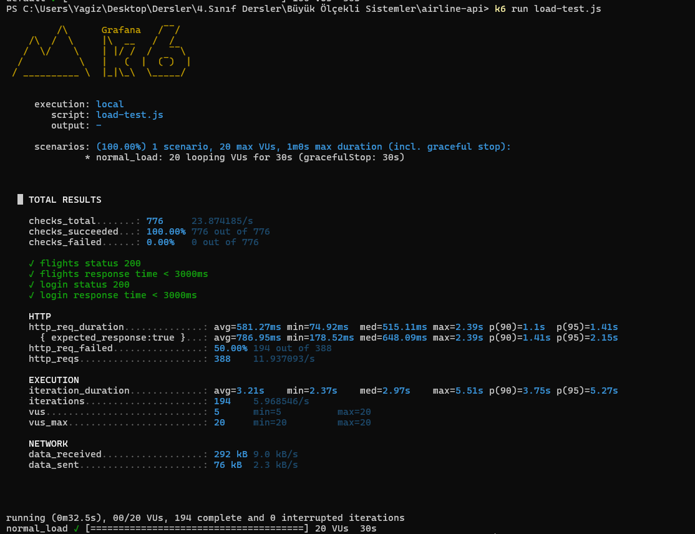
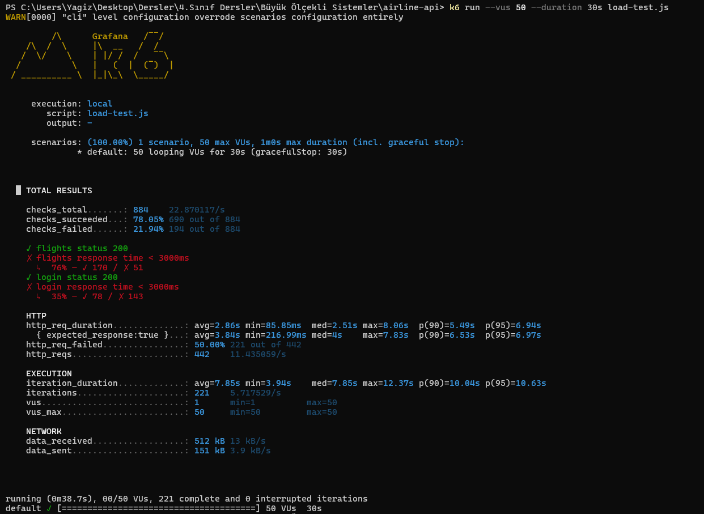
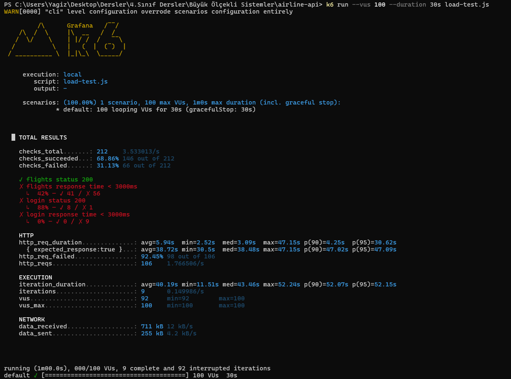

# SE4458 - Airline Ticketing System API

**Student:** Yağız Yungul  
**Course:** SE4458 Software Architecture & Design of Modern Large Scale Systems  
**Midterm Project:** Group 1 - Airline Company API

---

## Live URLs

- **API Swagger:** https://airline-api-yagiz.azurewebsites.net/api-docs
- **API Gateway:** http://airline-gateway-yagiz.azurewebsites.net

---

## Project Description

A RESTful airline ticketing system API built with Node.js and Express. The system follows a microservices architecture with an API Gateway routing to multiple backend services.

---

## Architecture

```
Client
   ↓
API Gateway (:4000)          ← rate limiting, routing
   ↓              ↓
Airline API (:3000)    Airport Service (:4001)
   ↓
Neon PostgreSQL
```

**Services:**
| Service | Port | Description |
|---|---|---|
| API Gateway | 4000 | Routes requests, applies rate limiting |
| Airline API | 3000 | Core ticketing system (flights, tickets, check-in) |
| Airport Service | 4001 | Airport information microservice (IATA codes, city/country data) |

---

## Tech Stack

- **Runtime:** Node.js + Express
- **Database:** PostgreSQL (Neon Cloud)
- **Authentication:** JWT
- **Documentation:** Swagger UI (OpenAPI 3.0)
- **Hosting:** Azure App Service (F1 Free)

---

## API Endpoints

| Endpoint | Method | Auth | Paging | Description |
|---|---|---|---|---|
| /api/v1/auth/register | POST | No | No | Register a new user |
| /api/v1/auth/login | POST | No | No | Login and get JWT token |
| /api/v1/flights | POST | ✅ Yes | No | Add a new flight |
| /api/v1/flights/upload | POST | ✅ Yes | No | Add flights via CSV file |
| /api/v1/flights | GET | No | ✅ Yes (page, pageSize) | Query available flights (3/day limit) |
| /api/v1/tickets | POST | ✅ Yes | No | Buy a ticket |
| /api/v1/checkin | POST | No | No | Check in a passenger |
| /api/v1/flights/:id/passengers | GET | ✅ Yes | ✅ Yes (page, pageSize) | Get passenger list |
| /api/v1/airports | GET | No | ✅ Yes (page, pageSize) | List airports (via Airport Service) |
| /api/v1/airports/:code | GET | No | No | Get airport info by IATA code |

### Pagination Parameters

Both `/api/v1/flights` and `/api/v1/flights/:id/passengers` support:
- `page` — page number (default: 1)
- `pageSize` — results per page (default: 10, max: 100)

---

## Running Locally

```bash
# Install all dependencies
npm run install:all

# Terminal 1 — Airline API (main)
npm run dev

# Terminal 2 — Airport Service
npm run dev:airports

# Terminal 3 — API Gateway
npm run dev:gateway
```

Access via gateway: `http://localhost:4000`  
Direct API docs: `http://localhost:3000/api-docs`

---

## Data Model

```
users         → id, username, password_hash, role, created_at
flights       → id, flight_number, date_from, date_to, airport_from, airport_to, duration, capacity, remaining_seats
tickets       → id, ticket_number, flight_id, user_id, purchase_date, status
passengers    → id, passenger_name, ticket_id, flight_id, seat_number, checked_in, check_in_date
query_logs    → id, user_id, ip_address, query_date, query_count
```

---

## Assumptions

- Seat numbering is sequential (1, 2, 3...) based on check-in order
- Rate limiting (3 queries/day per IP) is applied at both gateway and API level
- Round-trip search returns both outbound and return flights separately
- CSV format for bulk upload: `flightNumber,dateFrom,dateTo,airportFrom,airportTo,duration,capacity`
- JWT tokens expire after 24 hours
- pageSize defaults to 10, maximum 100

---

## Load Test Results

### Test Endpoints
1. `GET /api/v1/flights` — Query available flights
2. `POST /api/v1/auth/login` — User authentication

| Scenario | Virtual Users | Duration | Avg Response | p95 | Req/s | Error Rate |
|---|---|---|---|---|---|---|
| Normal Load | 20 | 30s | 672ms | 2.15s | 11.3 | 33.69% |
| Peak Load | 50 | 30s | 2.86s | 6.94s | 11.4 | 50% |
| Stress Load | 100 | 30s | 5.94s | 30.62s | 1.76 | 92.45% |

**Normal Load (20 VUs):**


**Peak Load (50 VUs):**


**Stress Load (100 VUs):**


**Analysis:** The bottleneck is the Azure F1 Free tier shared CPU. Upgrading to a paid tier with dedicated CPU, adding Redis caching for flight queries, and horizontal scaling would significantly improve performance.

---

## Demo Video

[Watch Demo Video](https://drive.google.com/drive/folders/19aw6ZpLtHLFf9_Bou0AEk0iJKk0nbxUn?usp=sharing)

---

## Links

- [GitHub Repository](https://github.com/yagizyungul/airline-api)
- [Live Swagger UI](https://airline-api-yagiz.azurewebsites.net/api-docs)
- [API Gateway](http://airline-gateway-yagiz.azurewebsites.net)
